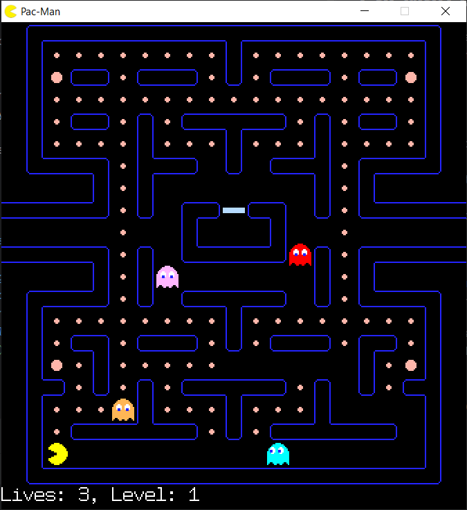

# PacMan Game 


This is a C++ implementation of the classic PacMan game using the SFML library. The game includes features such as ghost AI, collision detection, and game state management.

## Motivation
The main motivation behind this project was to explore game development using C++, one of the most widely used programming languages for game development, and SFML, a library that simplifies multimedia tasks such as graphics rendering, audio management, and window handling. This project also provided an opportunity to learn about and implement essential game development concepts like:
- Game loops
- Event handling
- Collision detection
- Basic AI (for enemy movement)

The ultimate goal was to create a fully functional game that could be packaged and released, while focusing on scalability and code structure for future expansion or improvements.


## Table of Contents
- [Installation](#installation)
- [Usage](#usage)
- [Game Mechanics](#game-mechanics)
- [Code Structure](#code-structure)
- [Contributing](#contributing)
- [Conclusion](#conclusion)
- [License](#license)

## Installation

### Prerequisites
- CMake 3.10 or higher
- SFML 2.5
- A C++ compiler that supports C++14

### Steps
1. **Clone the repository:**
    ```sh
    git clone https://github.com/YashPatel04/PacMan.git
    cd PacMan
    ```

2. **Set up SFML:**
    - Download and install SFML from [SFML's official website](https://www.sfml-dev.org/download.php).
    - Set the `SFML_DIR` in `CMakeLists.txt` to the path where SFML is installed.
    - Add `./your_saved_location/SFML/bin` to your run configuration or as your environment variable.
3. **Build the project:**
    ```sh
    mkdir build
    cd build
    cmake ..
    make
    ```

## Usage

### Running the Game
After building the project, you can run the game executable:
```sh
./PacMan
```

### Controls
- **Arrow Keys:** Move PacMan
- **Enter:** Start the game

## Game Mechanics

### PacMan
- **Movement:** Controlled by the arrow keys.
- **Objective:** Collect all pellets and avoid ghosts.

### Ghosts
- **AI:** Ghosts have different behaviors based on their type.
- **Frightened Mode:** Ghosts turn blue and can be eaten by PacMan when an energizer is collected.

### Winning and Losing
- **Win:** Collect all pellets.
- **Lose:** Collide with a ghost when it is not in frightened.

## Code Structure

### Main Components
- `main.cpp`: Entry point of the game.
- `Pacman.cpp` and `Pacman.h`: Contains the logic for PacMan's behavior.
- `Ghost.cpp` and `Ghost.h`: Contains the logic for the ghosts' behavior.
- `Map.cpp` and `Map.h`: Manages the game map and pellets.
- `collision.cpp` and `collision.h`: Handles collision detection.
- `Text.cpp` and `Text.h`: Manages text rendering in the game.

### CMakeLists.txt
The `CMakeLists.txt` file is used to configure the build process. It includes paths to SFML and lists all source files.

## Contributing
Contributions are welcome! Please follow these steps:
1. Fork the repository.
2. Create a new branch (`git checkout -b feature-branch`).
3. Commit your changes (`git commit -m 'Add some feature'`).
4. Push to the branch (`git push origin feature-branch`).
5. Open a pull request.

## Conclusion
This project serves as a strong foundation for learning game development principles using C++ and SFML. It replicates the classic gameplay of Pac-Man while leaving room for expansion and additional features. Whether you're an experienced programmer or a beginner looking to get into game development, this project offers valuable insights into how games are built from scratch, the challenges involved, and the satisfaction of watching your game come to life.


## License
This project is licensed under GNU GPL LICENSE
. See the `LICENSE` file for details.